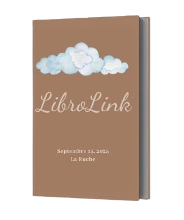

#  LibroLink

*LibroLink* is a collaborative book-sharing application that promotes learning, culture, and community. Users can borrow, lend, purchase, and comment on books while discovering personalized recommendations.

---

## 🚀 Features

- *👤 User Management*: Sign up, login, profiles, roles (admin, member, moderator)  
- *📚 Book Management*: Add, edit, delete books, advanced search, categories  
- *🔄 Borrowing & Returns*: Track borrows/returns, dynamic limits, automatic notifications  
-*🏠 Personal Library**: Wishlist, reading tracking  
-*🛒 Store & Cart**: Online purchase, cart management  
-*📝 Blogs & Comments**: Share reviews and recommendations  
-*🔔 Real-time Notifications**: Alerts for borrows, returns, messages, or achievements  
-*🤖 Smart Recommendations**: AI-powered book suggestions and sentiment analysis

---

## 🛠 Technologies Used

- *Backend*: Laravel 10  
- *Database*: MySQL  
- *Frontend*: Blade templates, Tailwind CSS / Bootstrap  

---

## ⚙ Installation

1. Clone the repository:  
git clone https://github.com/Abdessalem-Chaouch/Bookshare.git
cd LibroLink

2. Install dependencies:
composer install
npm install

3. Configure environment:
cp .env.example .env
php artisan key:generate

4. Set database credentials in .env:
DB_CONNECTION=mysql
DB_HOST=127.0.0.1
DB_PORT=3306
DB_DATABASE=librolink
DB_USERNAME=root
DB_PASSWORD=

5. Run migrations and seeders:
php artisan migrate --seed

6. Start the Laravel server:
php artisan serve

---

## 👨‍💻 Contributors

- [Eya Chamekh](https://github.com/eyachamekh)
- [Yosr Charek](https://github.com/YOSRcharek)
- [Doua Baghdadi](https://github.com/Douabaghdadi)
- [Aymen Khalifa](https://github.com/aymen-khelifa)
- [Abdessalem Chaouch](https://github.com/Abdessalem-Chaouch)

## 👨‍💻 Coach
- [Ghada Ben Khalifa](https://github.com/BenKhalifaGHADA)
---
